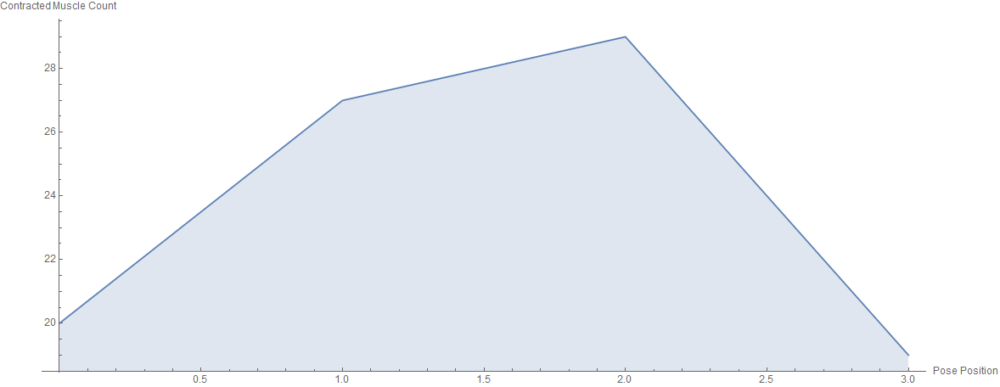
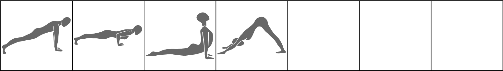

# Integration Series

| Number of Poses \| | Number of Vinyasas \| | Duration of Series (Minutes) |
|--------------------|-----------------------|------------------------------|
|                  3 |                     0 |                            4 |

What CorePower Yoga's *Power Yoga - 200 Hour Teacher Training* manual has to say about series:
* Integrates your mind, body, and sprit on the mat.
* Creates internal focus.
* Introduces and defines your breath.
* Warms up your spine with flexion and extension.
* Calms your nervous system.
* Offers Child's pose as a resting posture.
* Offers adjustments and assists.

Contractions Over Time

Most Contracted Muscles

Stretches Over Time

Most Stretched Muscles

Pose and Transition Schematics

*Images and graphs were generated using Wolfram Mathematica.*
