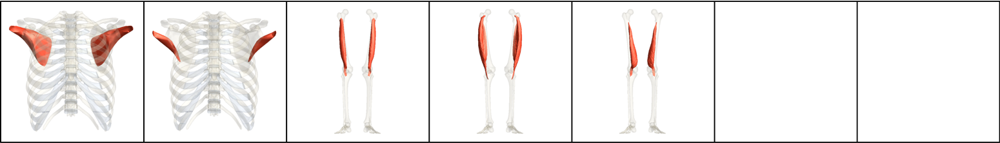
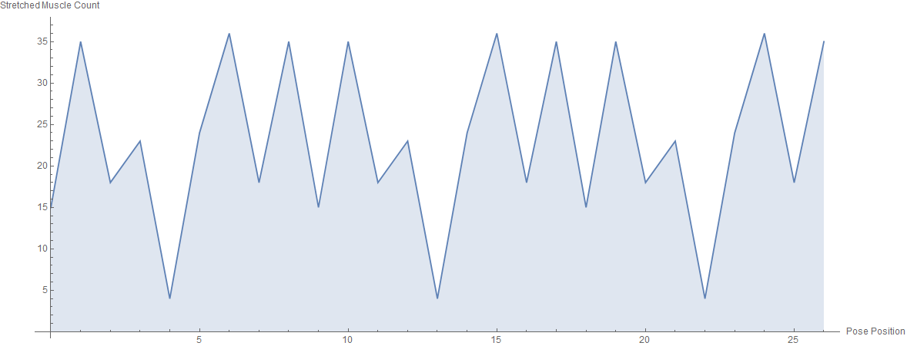
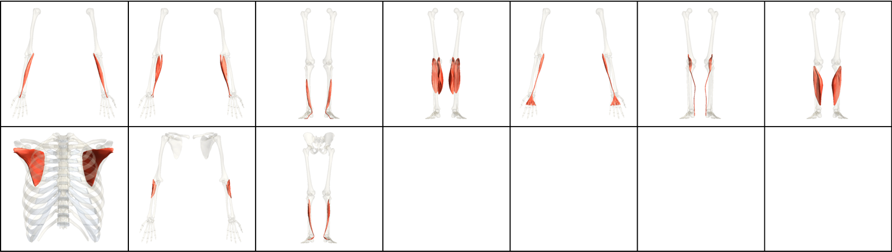
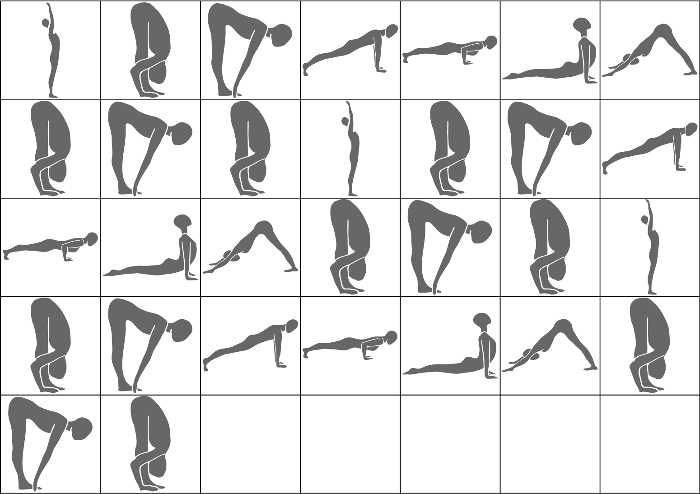

# Sun Salutation A

| Number of Poses \| | Number of Vinyasas \| | Duration of Series (Minutes) |
|--------------------|-----------------------|------------------------------|
|                 24 |                     3 |                            5 |

What CorePower Yoga's *Power Yoga - 200 Hour Teacher Training* manual has to say about series:
* Introduces vinyasa Chaturanga.
* Introduces foundational poses and cues.
* Continues to warm up your spine with flexion and extension.
* Introduces flow and establishes a rhythm.
* Builds internal heat.

Contractions Over Time

Most Contracted Muscles

Stretches Over Time

Most Stretched Muscles

Pose and Transition Schematics

*Images and graphs were generated using Wolfram Mathematica.*
