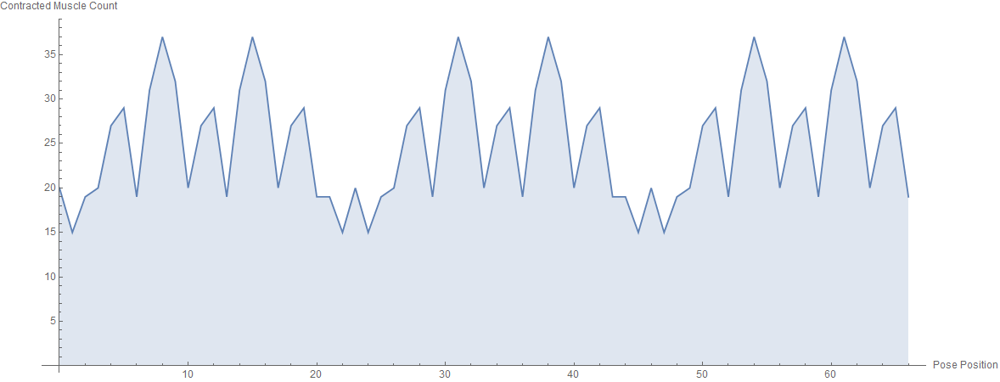
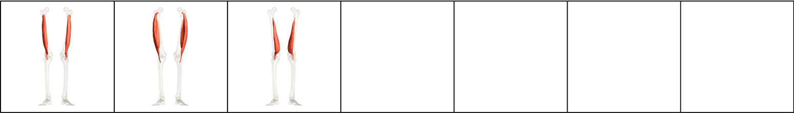
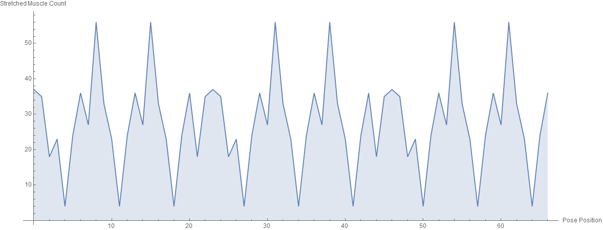
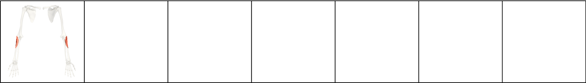
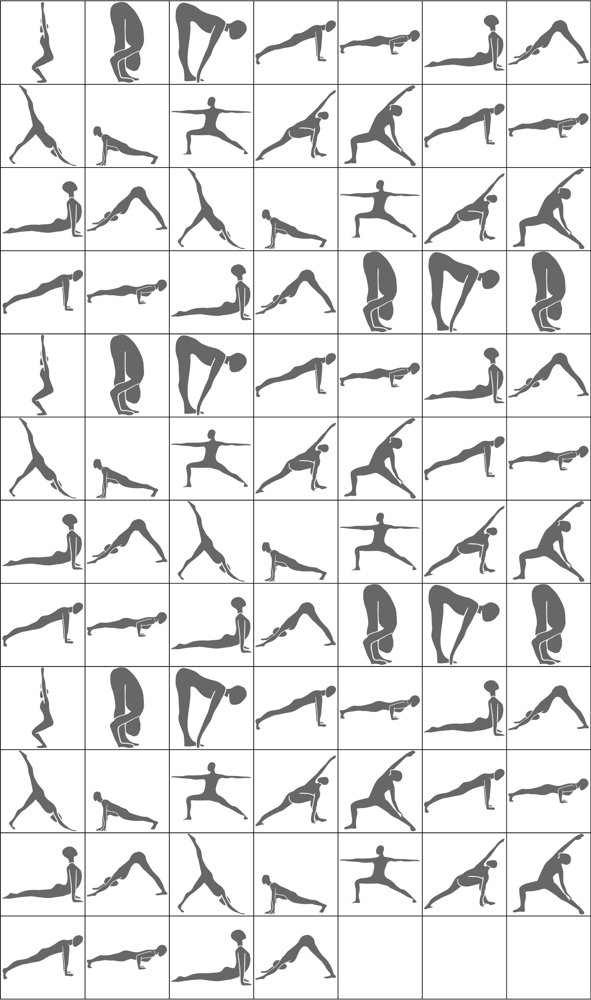

# Sun Salutation B

| Number of Poses \| | Number of Vinyasas \| | Duration of Series (Minutes) |
|--------------------|-----------------------|------------------------------|
|                 56 |                     9 |                           10 |

What CorePower Yoga's *Power Yoga - 200 Hour Teacher Training* manual has to say about series:
* Continues flo and builds internal heat.
* Introduces big full body movements.
* Syncs movement to breath creating an ebb and flow.
* Strengthens your legs.
* Opens your hips.
* Starts lateral spine flexion.

Contractions Over Time

Most Contracted Muscles

Stretches Over Time

Most Stretched Muscles

Pose and Transition Schematics

*Images and graphs were generated using Wolfram Mathematica.*
