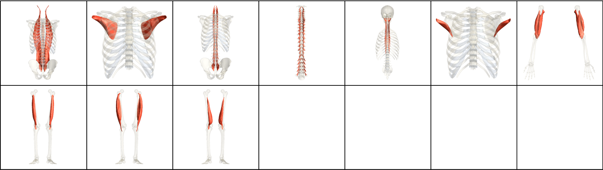
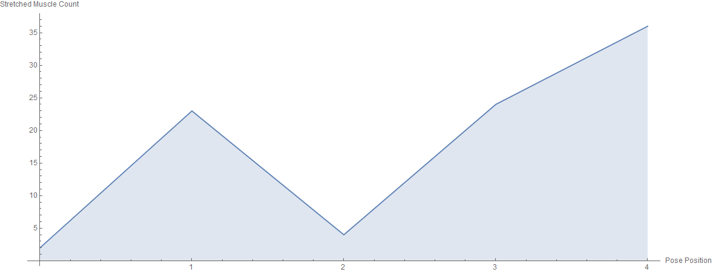

# Core Series

*Due to lack of data, Supta Baddha Konasana sit-ups and bicycle sit-ups are not considered in this section.*

| Number of Poses \| | Number of Vinyasas \| | Duration of Series (Minutes) |
|--------------------|-----------------------|------------------------------|
|                  4 |                     1 |                            3 |

What CorePower Yoga's *Power Yoga - 200 Hour Teacher Training* manual has to say about series:
* Rests your arms and legs, belly up.
* Activates your core to prepare for deep twists and balancing.
* Prepares you for all inversions.
* Connects students with the instructor face to face.

Contractions Over Time

Most Contracted Muscles

Stretches Over Time

Most Stretched Muscles

Pose and Transition Schematics

*Images and graphs were generated using Wolfram Mathematica.*
