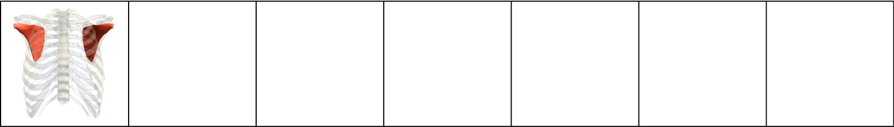

# Crescent Lunge Series

| Number of Poses \| | Number of Vinyasas \| | Duration of Series (Minutes) |
|--------------------|-----------------------|------------------------------|
|                 26 |                     3 |                           10 |

What CorePower Yoga's *Power Yoga - 200 Hour Teacher Training* manual has to say about series:
* Introduces balancing.
* Introduces deep twisting.
* Opens your hip flexors.
* Introduces arm balancing.

Contractions Over Time

Most Contracted Muscles

Stretches Over Time

Most Stretched Muscles

Pose and Transition Schematics

*Images and graphs were generated using Wolfram Mathematica.*
