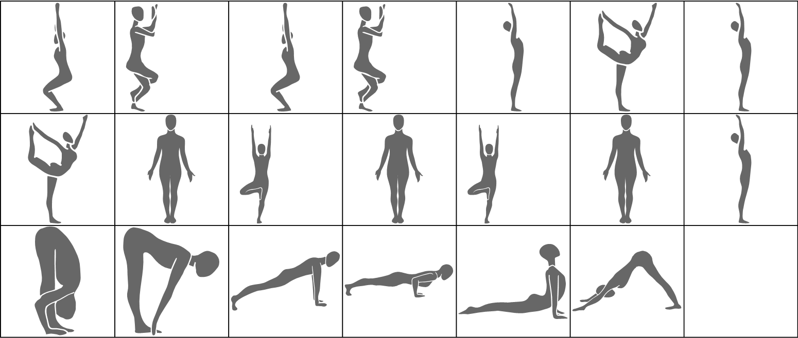

# Balancing Series

| Number of Poses \| | Number of Vinyasas \| | Duration of Series (Minutes) |
|--------------------|-----------------------|------------------------------|
|                 19 |                     1 |                            5 |

What CorePower Yoga's *Power Yoga - 200 Hour Teacher Training* manual has to say about series:
* Reestablishes your focus and drishti after arm balancing.
* Utilizes your core activation.
* Introduces pose and counter pose, contract, expand, neutralize.
* Unites your mind and body.

Contractions Over Time

Most Contracted Muscles

Stretches Over Time

Most Stretched Muscles

Pose and Transition Schematics

*Images and graphs were generated using Wolfram Mathematica.*
