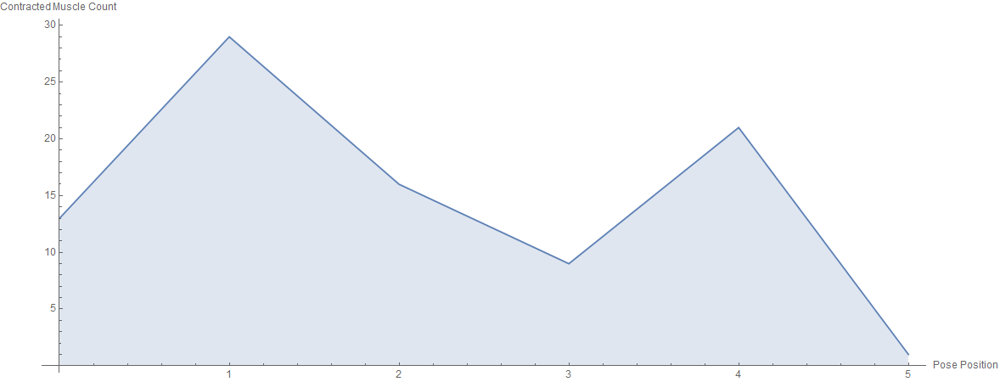
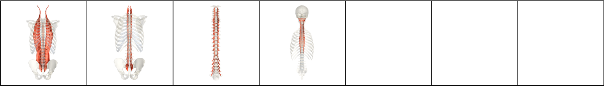
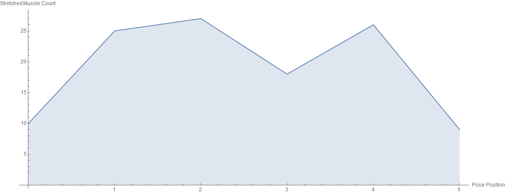
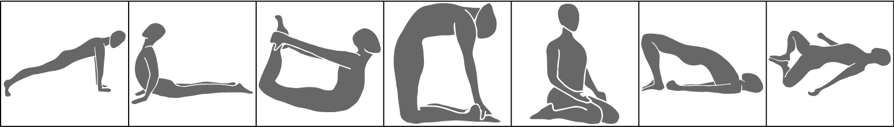

# Spine Series

| Number of Poses \| | Number of Vinyasas \| | Duration of Series (Minutes) |
|--------------------|-----------------------|------------------------------|
|                  5 |                     0 |                            4 |

What CorePower Yoga's *Power Yoga - 200 Hour Teacher Training* manual has to say about series:
* Introduces backbends when your body is most warm and ready.
* Focuses on poses that move against gravity.
* Requires established core strength and open hips.
* Strengthens your back body.
* Opens your front body.

Contractions Over Time

Most Contracted Muscles

Stretches Over Time

Most Stretched Muscles

Pose and Transition Schematics

*Images and graphs were generated using Wolfram Mathematica.*
