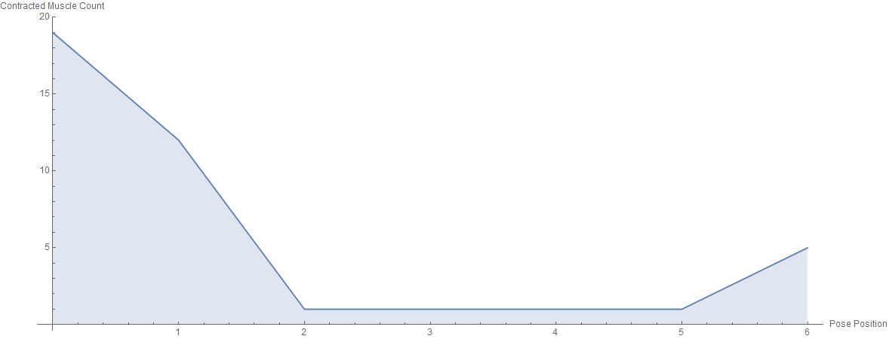
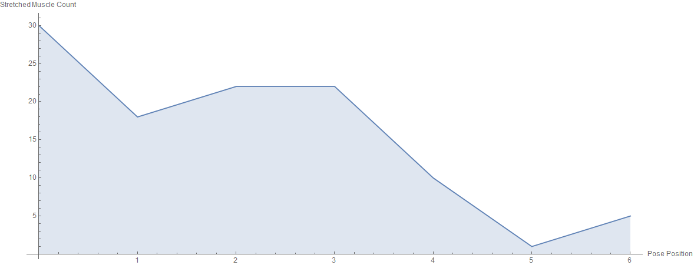
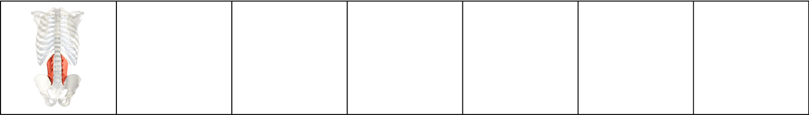
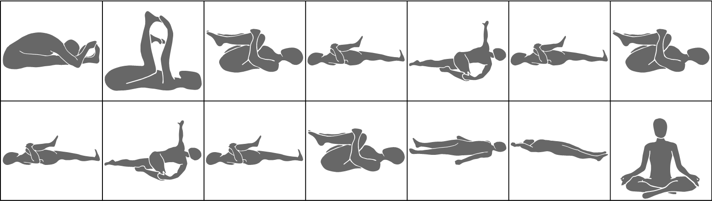

# Surrender Series

| Number of Poses \| | Number of Vinyasas \| | Duration of Series (Minutes) |
|--------------------|-----------------------|------------------------------|
|                  6 |                     0 |                            7 |

What CorePower Yoga's *Power Yoga - 200 Hour Teacher Training* manual has to say about series:
* Neutralizes your spine.
* Cools your body.
* Allows rest and restoration.
* Allows a total body release.

Contractions Over Time

Stretches Over Time

Most Stretched Muscles

Pose and Transition Schematics

*Images and graphs were generated using Wolfram Mathematica.*
