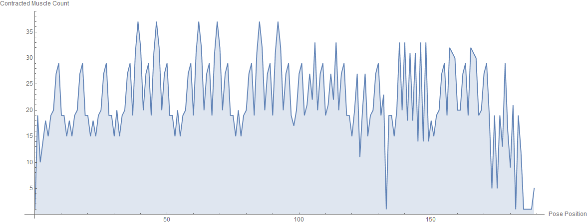
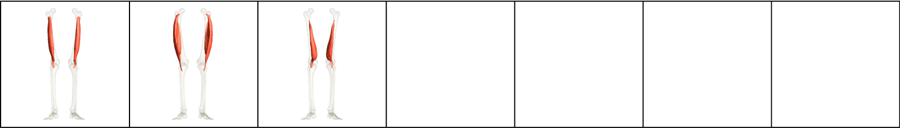
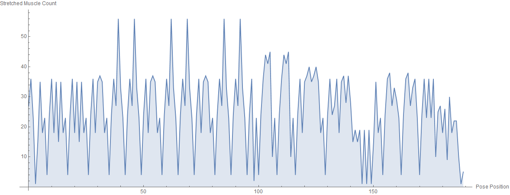
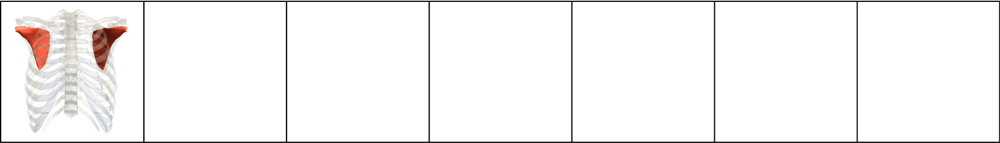

# C1 Series

| Number of Poses \| | Number of Vinyasas \| | Duration of Series (Minutes) |
|--------------------|-----------------------|------------------------------|
|                162 |                    19 |                           60 |

What CorePower Yoga's *Power Yoga - 200 Hour Teacher Training* manual has to say about series:
* The CorePower Yoga C1 Sequence is designed to give students a well rounded introductory yoga experience in 60 minutes.

Contractions Over Time

Most Contracted Muscles

Stretch Muscles Over Time

Most Stretched Muscles

Pose and Transition Schematics

*Images and graphs were generated using Wolfram Mathematica.*
